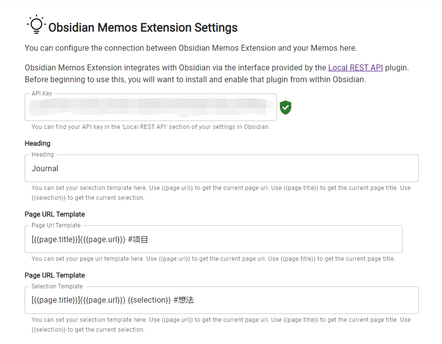

# Obsidian Memos Extension

This is an official Chrome extension for [Obsidian Memos](https://github.com/Quorafind/Obsidian-Memos) that lets you send content from the web to your memos in Obsidian.

You will just need to install the extension and right click your selection or page and select "Send to Obsidian Memos".

> Thanks to [coddingtonbear](https://github.com/coddingtonbear/obsidian-web) for the original code.

## Prerequisites

* [Obsidian Local REST API](https://github.com/coddingtonbear/obsidian-local-rest-api)
  * Note: Supports use only with the default port (27124).

You can read the instruction in Chinese here: 

## Quickstart

1. Install this extension from releases, **not available on Chrome Store yet**.
2. Install and enable [Obsidian Local REST API](https://github.com/coddingtonbear/obsidian-local-rest-api) from the Obsidian Community Plugins settings in Obsidian.
3. Click on the "Obsidian Memos Extension" icon in your toolbar and follow the displayed instructions.

Now you should be able to send content from the web to your memos in Obsidian.

## Options

Options can be accessed by right-clicking on the icon in your toolbar or pressing  "Options/选项".



## Development

```
npm i
npm run dev
```

OR

```
yarn
yarn dev
```

Then: load your "unpacked extension" from [Chrome Extensions](chrome://extensions/) by pointing Chrome at the `dist` folder.  Afterward, you will receive some instructions whenyou click on the "Obsidian Web" icon in your toolbar.
